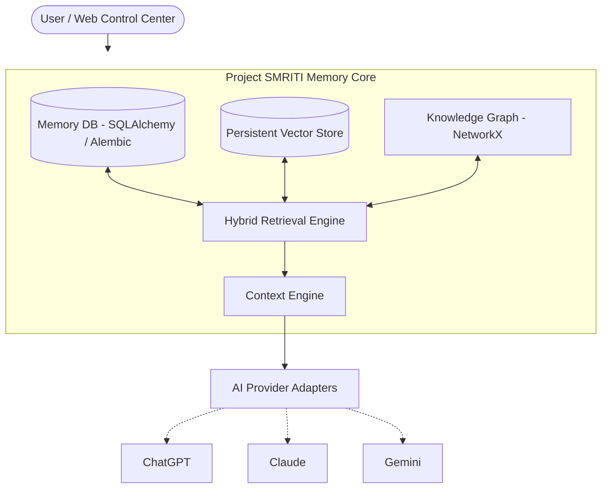

# Project SMRITI

> **A persistent, portable personal AI memory layer for connecting knowledge across ChatGPT, Claude, Gemini, and future AI platforms.**

---

## 1. Vision & Core Principle

The fundamental principle of **Project SMRITI** (*Smriti* meaning memory or remembrance in Sanskrit) is:

> **"My knowledge belongs to me, not to a particular AI platform."**

AI systems are reasoning interfaces. **SMRITI is the persistent, portable personal memory layer.**

Today, users accumulate deep contextual insights, architectural decisions, and iterative breakthroughs across disparate AI platforms. However, each system operates as an isolated silo. SMRITI acts as a sovereign cognitive layer above these tools, enabling users to carry forward their accumulated knowledge and project state seamlessly across reasoning models without vendor lock-in.

---

## 2. The Problem

Modern technical workflows frequently span multiple AI ecosystems—a user may sketch architectural concepts in Claude, draft implementations in ChatGPT, and run deep document research in Gemini. This fragmented workflow creates friction:

1. **Context Fragmentation**: Critical reasoning, trade-offs, and decisions remain trapped inside vendor-specific conversation histories.
2. **Repetitive Onboarding**: Starting a new session requires manually re-explaining the entire project background, architecture, and previous decisions.
3. **Loss of Provenance**: Users cannot easily track which model suggested a solution, when an architectural pivot was decided, or which message served as the original source.
4. **Context Window Exhaustion**: Blindly dumping raw conversation transcripts into prompts saturates context windows and degrades model attention.
5. **Vendor Enclosure**: Switching models or adopting new AI platforms requires leaving behind years of accumulated reasoning.

---

## 3. The SMRITI Solution

SMRITI does **not** attempt to synchronize raw chat transcripts or mirror active runtime sessions across providers.

Instead, SMRITI extracts, normalizes, and maintains **structured project state and relational knowledge** independent of the underlying AI provider. By distilling conversations into a structured knowledge graph, persistent vector index, and dynamic project state, SMRITI synthesizes compact, goal-driven context packages tailored for immediate consumption by whatever AI platform the user chooses next.

---

## 4. Architecture

SMRITI positions itself as an independent abstraction layer between the user and conversational AI platforms:

```text
                AI PLATFORMS
           (ChatGPT, Claude, Gemini)
                     │
                     ▼
          SMRITI INTEGRATION LAYER
            (Provider Adapters)
                     │
                     ▼
                SMRITI CORE
                     │
        ┌────────────┼────────────┐
        ▼            ▼            ▼
     Memory       Retrieval      Graph
       DB          Engine       Layer
   (SQLAlchemy)  (Hybrid & Vec) (NetworkX)
        │            │            │
        └────────────┼────────────┘
                     ▼
              CONTEXT ENGINE
                     │
                     ▼
          PORTABLE AI CONTEXT
```



---

## 5. Canonical Memory Model & Provenance

### Structured Memory Entities
SMRITI represents knowledge through canonical, relational entities:
* **User**: The owner of the memory space.
* **Workspace**: Isolated domain contexts (e.g., Personal, Work, College) preventing accidental cross-context leakage.
* **ProviderAccount**: Specific provider connections (e.g., ChatGPT Personal vs. ChatGPT Work).
* **Conversation**: Normalized container for session transcripts.
* **Message**: Individual conversation turns with sequence indexes, roles, and timestamps.
* **Project**: Structured workspace initiatives tracking goals, tech stacks, and constraints.
* **Task**: Actionable items tracking priorities, statuses, and dependencies.
* **Memory**: Distilled facts, decisions, problems, solutions, constraints, and technologies.
* **MemoryVersion**: Versioned ledger of memory modifications and supersessions.
* **RelationshipEdge**: Persistent graph links (`BELONGS_TO`, `CONTAINS`, `SUPERSEDES`, `DEPENDS_ON`, `RELATED_TO`).

### Complete Provenance (Explain This Memory)
Every persistent memory can be traced back to its origin:
```text
Memory
  ↓ (source_message_id)
Message
  ↓ (conversation_id)
Conversation
  ↓ (provider_account_id)
ProviderAccount
  ↓
Provider (ChatGPT / Claude / Gemini)
```

For manually created memories, provenance explicitly designates them as `user_explicit` without fabricating artificial conversation records. If a source conversation is deleted, the provenance and explain endpoints mark the source status as `source_unavailable` rather than silently purging or breaking the derived memory.

---

## 6. Hybrid Retrieval & Context Engine

SMRITI avoids dumping entire conversation histories into prompts. Instead, it utilizes hybrid retrieval:

1. **Full-Text Lexical Search**: Keyword matching over statements, rationales, and memory types in the database.
2. **Deterministic Vector Embeddings**: Cosine similarity over persistent, deterministic character n-gram and term-frequency vectors that survive restarts.
3. **Knowledge Graph Expansion**: Graph traversal discovering 1-hop connected facts and active constraints.
4. **Context Synthesis**: Compiles a compact, token-budgeted prompt package containing project goals, active tasks, key decisions, and active constraints.

---

## 7. Zero-Loss Canonical Portability

SMRITI provides complete data sovereignty through its versioned canonical export/import engine (`v1.1.0`):

```text
Original Database
       │
       ▼ (Export Canonical JSON)
Canonical Archive (manifest, users, workspaces, provider accounts,
                   projects, tasks, conversations, messages,
                   memories, versions, graph edges, audit logs)
       │
       ▼ (Import Canonical JSON)
Fresh Database
       │
       ▼ (Semantic Equivalence & Index Rebuild)
Identical SMRITI State
```

Exports can be executed globally or scoped to specific workspaces. Imports validate schema integrity before executing atomic database transactions.

---

## 8. Implementation Status

| Subsystem | Status | Implementation Details |
| :--- | :--- | :--- |
| **Database Migrations** | **IMPLEMENTED** | Alembic migration environment (`alembic/versions/84f31e60a4d2_initial_schema.py`) managing all models. |
| **Persistent Vector Store** | **IMPLEMENTED** | Deterministic hashed embedding service + disk-backed JSON index with `rebuild_from_db()` recovery. |
| **Workspace Isolation** | **IMPLEMENTED** | Multi-workspace boundaries enforced across database queries, vector searches, and context generation. |
| **Complete Provenance** | **IMPLEMENTED** | Full traceability down to message, conversation, and provider account; manual memories correctly tagged. |
| **Canonical Portability** | **IMPLEMENTED** | Zero-loss atomic export/import format (`v1.1.0`) with manifest validation and transactional safety. |
| **API Integration Tests** | **IMPLEMENTED** | 18 automated unit and integration tests passing cleanly via `pytest`. |
| **Web Control Center** | **IMPLEMENTED** | React + TypeScript + Vite control center providing Dashboard, Memory Bank, Graph Visualizer, and Context Generator. |
| **Provider Importers** | **IMPLEMENTED** | Normalization parsers for ChatGPT, Claude, Gemini, and Generic standard formats. |
| **Provider Adapters** | **PROTOTYPE** | Adapter layer providing prompt formatting and capability matrix discovery. |
| **Real-Time Webhooks** | **PROVIDER-DEPENDENT** | Dependent on official provider webhooks or MCP server support. |
| **Live Session Sync** | **PROVIDER-DEPENDENT** | Dependent on official provider APIs exposing active session manipulation. |

---

## 9. Capability Roadmap

The development of Project SMRITI follows a capability-based progression:

### Phase 1 — Core Reliability & Portability (Current)
- Database schema management via authoritative Alembic migrations.
- Persistent vector storage with deterministic embeddings and rebuild capabilities.
- Workspace and provider-account boundary isolation.
- Comprehensive provenance tracking and explainability.
- Atomic, validated canonical export/import engine.
- Complete API integration test suite.

### Phase 2 — Intelligent Memory & Extraction
- Hybrid heuristic and LLM-assisted entity and relationship extraction.
- Automatic project state synthesis and milestone detection.
- Fine-grained memory diff detection (superseded, conflicting, new).
- User-directed interactive conflict resolution workflows.

### Phase 3 — Advanced Retrieval & Multi-Space Search
- Deep vector search with upgradeable pgvector / local dense embedding models.
- Graph-augmented retrieval with multi-hop topological reasoning.
- Cross-workspace explicit sharing and selective subgraph publishing.
- Staleness indicators and temporal memory decay algorithms.

### Phase 4 — Provider Integrations & MCP
- Formal Model Context Protocol (MCP) server integration for Claude and compatible agents.
- Custom GPT actions and plugin endpoints for authorized ChatGPT access.
- Official Gemini Extensions and Function Calling integrations.
- Local model execution adapters (e.g., Ollama, vLLM).

### Phase 5 — Production Hardening & Encryption
- Full PostgreSQL backend deployment profile.
- End-to-end local field encryption for sensitive memory rationales and conversation snippets.
- Granular role-based access control and multi-user authentication.
- Automated secret and PII redaction during ingestion.

---

## 10. Local Setup & Testing

### Prerequisites
- Python 3.10+
- Node.js 18+ and npm

### Backend Setup
1. Clone the repository:
   ```bash
   git clone https://github.com/Aditya-Patil06/SMRITI.git
   cd SMRITI
   ```
2. Install Python dependencies:
   ```bash
   pip install -e ".[dev]"
   # Or install dependencies directly:
   pip install fastapi uvicorn sqlalchemy alembic networkx numpy pytest httpx
   ```
3. Apply database migrations:
   ```bash
   alembic upgrade head
   ```
4. Run tests:
   ```bash
   pytest
   ```
5. Start the SMRITI API server:
   ```bash
   uvicorn smriti.api:app --reload --port 8000
   ```

### Frontend Setup
1. Navigate to the frontend directory:
   ```bash
   cd frontend
   npm install
   ```
2. Run production build check:
   ```bash
   npm run build
   ```
3. Start the Vite development server:
   ```bash
   npm run dev
   ```

---

## 11. Repository Structure

```text
.
├── alembic/                      # Database migrations
│   ├── env.py                    # Alembic migration environment
│   └── versions/                 # Versioned migration revisions
├── alembic.ini                   # Alembic configuration
├── frontend/                     # Web Control Center (React + TypeScript + Vite)
│   ├── src/
│   │   ├── api.ts                # Typed SMRITI API client
│   │   ├── App.tsx               # Control Center dashboard & views
│   │   └── main.tsx              # Application entry point
│   ├── package.json
│   └── vite.config.ts
├── pyproject.toml                # Python project configuration & dependencies
├── smriti/                       # Core Python package
│   ├── api.py                    # FastAPI REST API endpoints
│   ├── canonical_export.py       # Zero-loss export/import engine
│   ├── config.py                 # Configuration and environment settings
│   ├── context_engine.py         # Portable context package synthesizer
│   ├── extraction.py             # Memory candidate extraction
│   ├── graph.py                  # NetworkX knowledge graph service
│   ├── importers/                # Multi-provider conversation parsers
│   │   ├── chatgpt.py
│   │   ├── claude.py
│   │   ├── gemini.py
│   │   └── generic.py
│   ├── memory_manager.py         # Lifecycle, provenance, and conflict resolution
│   ├── models.py                 # SQLAlchemy canonical data models
│   ├── providers/                # Provider adapters and capabilities
│   ├── retrieval.py              # Hybrid retrieval (lexical + vector + graph)
│   ├── schemas.py                # Pydantic V2 schemas
│   └── vector_store.py           # Persistent vector store and embeddings
└── tests/                        # Automated test suites
    ├── test_api_integration.py   # API integration, isolation, and portability tests
    └── test_smriti_core.py       # Core unit and round-trip tests
```

---

## 12. Privacy & Security Principles

* **Local-First**: All relational records, vector indices, and knowledge graphs reside on user-controlled hardware.
* **No Credential Ingestion**: SMRITI never asks for, stores, or handles raw AI provider account passwords.
* **Strict Boundary Isolation**: Memories in one workspace never cross into another without explicit user action.
* **Zero Private Commits**: Conversation archives, local databases, and environment secrets are excluded from Git.
